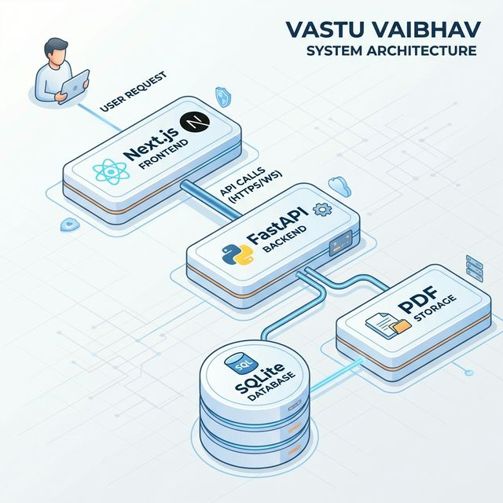
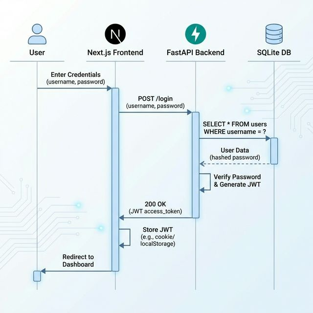
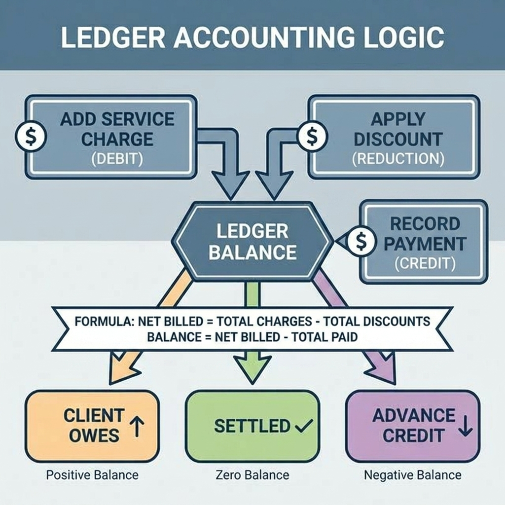
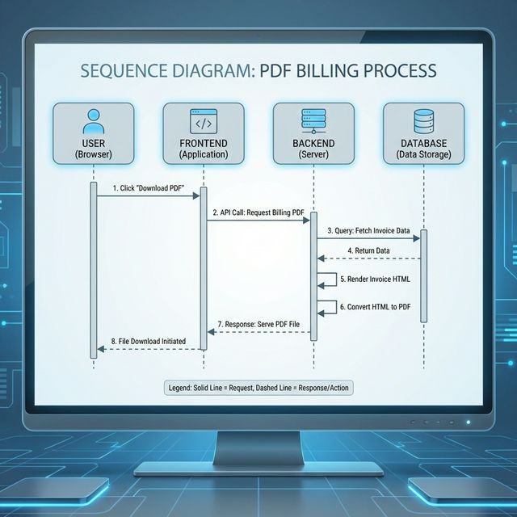
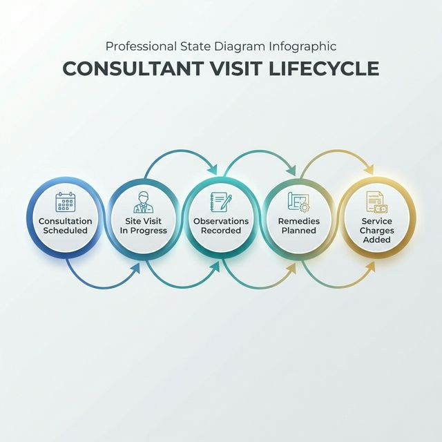

# Vastu Consultant Ledger Application

## Complete Technical Architecture & Engineering Blueprint (v2.0 - Deep Technical Specification)

---

# 1. System Vision

A secure, mobile-first Progressive Web App (PWA) for a Vastu consultant to manage:

## 1.1 System Architecture

## 1.2 Authentication Flow

## 1.3 Ledger Business Logic

## 1.4 PDF Billing Sequence

## 1.5 Visit Lifecycle

---

# 2. Domain & Business Logic

## 2.1 Ledger Computation

TotalServices(client) = SUM(service_entries.amount)
TotalPaid(client) = SUM(payments.amount)
Balance = TotalServices - TotalPaid

Balance meaning:

* > 0 → Client owes consultant
* = 0 → Settled
* < 0 → Client has advance credit

No tax logic.
No locking of entries.
Editable ledger.

---

# 3. Database Design (PostgreSQL)

## 3.1 Design Principles

* UUID primary keys
* Strict foreign key enforcement
* ON DELETE RESTRICT for clients
* Indexed foreign keys
* Numeric(12,2) for financial fields

---

## 3.2 Tables

### users

* id UUID PK
* email VARCHAR UNIQUE
* password_hash VARCHAR
* twofa_secret VARCHAR NULL
* is_2fa_enabled BOOLEAN DEFAULT FALSE
* created_at TIMESTAMP
* updated_at TIMESTAMP

### clients

* id UUID PK
* name VARCHAR NOT NULL
* phone VARCHAR
* email VARCHAR
* personal_address TEXT
* project_site_address TEXT
* built_up_area NUMERIC
* notes TEXT
* status VARCHAR CHECK (status IN ('active','archived'))
* created_at TIMESTAMP
* updated_at TIMESTAMP

### visits

* id UUID PK
* client_id UUID FK REFERENCES clients(id)
* visit_date DATE
* notes TEXT
* created_at TIMESTAMP
* updated_at TIMESTAMP

### service_catalog

* id UUID PK
* name VARCHAR NOT NULL
* base_price NUMERIC(12,2)
* description TEXT
* created_at TIMESTAMP
* updated_at TIMESTAMP

### service_entries

* id UUID PK
* visit_id UUID FK REFERENCES visits(id) ON DELETE CASCADE
* description TEXT
* amount NUMERIC(12,2) CHECK (amount >= 0)
* created_at TIMESTAMP
* updated_at TIMESTAMP

### payments

* id UUID PK
* client_id UUID FK REFERENCES clients(id)
* amount NUMERIC(12,2) CHECK (amount > 0)
* payment_date DATE
* method VARCHAR
* notes TEXT
* created_at TIMESTAMP
* updated_at TIMESTAMP

### generated_bills

* id UUID PK
* client_id UUID FK REFERENCES clients(id)
* generated_at TIMESTAMP
* total_services NUMERIC(12,2)
* total_paid NUMERIC(12,2)
* balance NUMERIC(12,2)
* pdf_filename VARCHAR
* pdf_path TEXT

---

# 4. Backend Architecture (FastAPI)

## 4.1 Layered Structure

backend/
app/
main.py
config.py
db.py
models/
schemas/
services/
routers/
security/
pdf/
utils/

Layer separation:

* Routers → API layer
* Services → business logic
* Models → ORM

---

## 4.2 Authentication

* bcrypt password hashing
* JWT access token (15 min expiry)
* Refresh token (7 days)
* TOTP 2FA (pyotp compatible)
* Future: WebAuthn optional

---

# 5. Frontend Architecture (Next.js PWA)

## 5.1 Structure

frontend/
app/
components/
services/
hooks/
store/

## 5.2 State

* React Query for server state
* Context for auth
* LocalStorage for token persistence

## 5.3 PWA Behavior

* Service worker enabled
* Offline caching for static files
* API requires internet

---

# 6. PDF Generation

## Flow

1. Aggregate ledger
2. Render HTML (Jinja2)
3. Convert to PDF (WeasyPrint/wkhtmltopdf)
4. Save to /data/generated_bills/
5. Store record in DB

File naming:
VASTU_<ClientNameNoSpaces>*<YYYYMMDD>*<HHMM>.pdf

---

# 7. Security Hardening (Home Server)

* Let’s Encrypt SSL
* HTTPS enforced
* Rate limiting via reverse proxy
* Fail2Ban enabled
* Firewall only allow 80/443
* Secure HTTP headers

---

# 8. Backup Strategy

Daily:
pg_dump → gzip → local storage

Offsite:
Upload to Oracle Object Storage

Retention:

* 30 daily
* 6 monthly

Quarterly restore test required.

---

# 9. Deployment Plan

Docker Compose services:

* backend
* postgres
* reverse proxy

Environment variables:

* DATABASE_URL
* JWT_SECRET
* SMTP_CONFIG
* BACKUP_BUCKET

---

# 10. Migration Strategy

To move to cloud:

* Move DB
* Move backend container
* Move PDF storage
* Update DNS

No schema redesign required.

---

# 11. Performance

<5 users
Low traffic
Single 2GB RAM machine sufficient

---

# 12. Risk Register

* ISP downtime
* Power outage beyond UPS
* Misconfigured rate limiting
* Backup failure

Mitigations documented above.

---

Version 2.0 - Deep Technical Specification
Ready for build phase.
